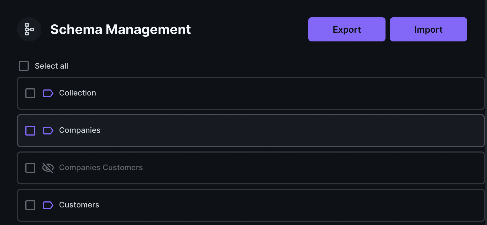

[](https://badge.fury.io/js/directus-extension-schema-management-module)

# Introduction
Tired of creating the same collection all over again? This module extension can make it easier to share schema between Directus instances. Simply copy the schema code from one Directus and paste it to the other and you are done.

- **Export/import schema definitions as code**. Choose any collections you want to export as code. You can choose to download or view the code. The downloaded code can be uploaded to another Directus to restore the chosen collections.
- **Lightweight**. No third-party libraries.
- **Pre-built Schemas**. Visit [directus-schema-collection](https://github.com/rezo-labs/directus-schema-collection) and choose any pre-built schemas that fit your use case to rapidly setup your Directus app.



# Installation
```
npm i directus-extension-schema-management-module
```

# Get Started
1. Go to **Settings** -> **Project Settings**, in the **Modules** section, enable module **Schema Management Module**.

# TODO
- Automatically select junction collections when selecting collections that have M2M relations.
- Automatically rollback if importing failed.
